# 基于招聘数据的可视化系统设计与实现

> 公开脱敏版：保留论文正文与技术插图；学校模板、页眉页脚、校徽、身份元数据不进入公开文件，含个人资料或凭据的截图已隐藏。

目 录

## 绪论

本章节阐述招聘数据可视化系统的研究背景，研究意义，发展现状，以及阐述本文主要内容。

### 研究背景

随着全球化和技术进步的不断推进，企业对人才的需求愈加多样化和复杂化。特别是在信息化时代，招聘成为企业发展的关键因素之一。传统的招聘方式往往依赖于手工筛选、简单的表格或数据库记录，难以高效地处理大量的候选人信息，导致招聘过程低效、繁琐，难以对人才市场的动态变化做出及时反应。尤其在大数据时代，招聘过程产生的数据量庞大，如何有效地管理和分析这些数据，成为企业招聘部门亟需解决的问题。

招聘数据涉及的内容广泛，包括应聘者的个人信息、教育背景、工作经验、技能特长、面试反馈等，以及与职位要求匹配度、薪资待遇、工作地点等相关的数据。这些数据通常来源于多个平台和渠道，如招聘网站、公司内部数据库、社交网络等，形成了海量且多样化的数据集合。如何在众多信息中提取出有价值的内容，并根据企业需求进行分析，成为提高招聘效率和质量的关键。

因此，基于招聘数据的可视化系统应运而生。通过数据可视化技术，可以将复杂的招聘数据以图形、图表等直观的方式展示出来，帮助招聘人员更快速地理解和分析数据。可视化系统能够整合多维度的数据，进行实时监控和分析，提升招聘决策的科学性和精确性。通过对招聘数据的深入挖掘和可视化呈现，企业可以优化招聘流程、提高人才筛选效率、降低招聘成本，从而更好地匹配企业发展需求，推动组织人才的合理配置。

在这样的背景下，设计并实现一个高效的招聘数据可视化系统显得尤为重要，不仅能够提升招聘部门的工作效率，还能为企业的战略决策提供数据支持和决策依据。

### 研究意义

随着企业竞争日益激烈，人才已成为决定企业成败的关键因素。招聘作为企业获得优秀人才的重要途径，其效率和质量直接影响到企业的持续发展和创新能力。然而，传统的招聘方式往往面临着数据处理效率低、信息筛选不准确以及决策依据不足等问题。基于招聘数据的可视化系统设计与实现，能够有效地解决这些问题，具有重要的现实意义和应用价值。

招聘数据的可视化能够显著提高招聘过程的效率。在传统的招聘中，招聘人员往往需要手动筛选简历、处理应聘者信息，并通过经验判断是否符合岗位要求。这一过程繁琐且容易出现人为偏差。而通过可视化系统，招聘人员能够通过图表、仪表盘等直观方式快速获得候选人信息的概览，实时查看各类招聘数据的变化趋势，从而提升信息处理的速度和准确性。

数据可视化能够帮助招聘人员做出更为科学的决策。通过对海量招聘数据的分析与展示，系统可以帮助招聘人员发现潜在的规律和趋势，例如各类岗位的需求量、不同地区的薪资水平、候选人的学历背景分布等。这些数据分析结果能够为招聘策略的制定提供重要依据，避免了依赖个人经验的盲目性，提高了决策的科学性和精确性。

基于招聘数据的可视化系统有助于招聘过程中的透明化和标准化。通过系统的统一管理，所有招聘数据都可以在平台上进行集中展示和分析，避免了信息孤岛的现象。同时，系统还能够实现招聘过程的自动化监控和管理，确保招聘流程的规范性，减少人为失误和偏差，提升招聘质量。

### 国内外研究现状

在全球范围内，招聘数据的可视化已经成为人力资源管理（HRM）领域的重要技术趋势，尤其是在欧美等发达国家。随着大数据技术、人工智能（AI）和机器学习（ML）等技术的快速发展[1]，企业对招聘流程的数据分析和可视化需求不断增加。越来越多的公司开始采用先进的招聘数据可视化工具，来提升招聘效率、优化招聘决策和提升候选人体验。

#### 国外研究现状

在国外，招聘数据可视化系统主要依赖大数据技术和AI算法，通过自动化的数据收集、处理和分析来实现招聘过程的可视化。工具如Tableau、Power BI等已广泛应用于招聘领域[2]，帮助企业将招聘数据（如候选人数量、简历筛选进度、面试反馈等）以图形化方式展示，使招聘人员能够更直观地了解整个招聘流程。尤其在招聘分析中，通过机器学习算法对候选人的匹配度、面试结果等进行深入分析，从而为招聘决策提供科学依据。

许多欧美企业已经开始将招聘过程智能化，利用自然语言处理（NLP）技术自动分析候选人简历，结合AI算法来判断候选人与岗位的匹配度[3]。例如，LinkedIn、Indeed等全球招聘平台已经通过智能推荐系统来优化职位与候选人之间的匹配。这些平台能够通过对大量历史招聘数据的学习，预测哪些候选人更有可能成功应聘某一职位，从而帮助招聘人员提高筛选效率。

除了单纯的招聘数据可视化工具，国外许多企业还构建了集招聘、培训、人才管理于一体的综合性人力资源管理平台。例如，Workday、SAP SuccessFactors等企业资源计划（ERP）系统，通过对企业招聘、员工绩效、薪资、晋升等数据的集中管理，帮助企业实现从招聘到员工发展的全生命周期管理。这些平台不仅具备数据可视化功能，还能提供人才库分析、招聘成本分析、员工流失预测等高级数据分析功能。

在国内，招聘数据的可视化应用起步较晚，但随着大数据技术和AI技术的快速发展，招聘数据可视化在企业中的应用正在逐渐增多。尤其是随着互联网招聘平台的兴起，招聘数据的积累和分析变得越来越重要，国内许多企业开始重视招聘过程中的数据化管理。

#### 国内研究现状

国内的招聘平台，如猎云网、BOSS直聘、智联招聘等，已经开始集成招聘数据可视化功能，帮助企业在招聘过程中实时监控数据指标，如职位发布量、应聘者数量、简历筛选通过率等。这些平台的招聘数据可视化功能，不仅帮助企业优化招聘策略，还能为招聘人员提供更高效的招聘管理工具。比如，BOSS直聘就通过数据可视化工具展示招聘需求、应聘者情况、面试进展等，帮助招聘人员直观地掌握招聘全貌，及时调整招聘计划[4]。

国内一些大型企业开始尝试构建自己的招聘数据可视化平台。例如，华为、阿里巴巴、腾讯等大型互联网公司，已经在其招聘过程中引入了数据分析和可视化工具。这些平台不仅实现了招聘数据的实时监控，还能够通过数据分析发现潜在问题，如招聘周期过长、候选人质量不高等，从而优化招聘策略，提升招聘效果。

招聘数据隐私与合规问题: 随着数据隐私保护法规的出台，尤其是《个人信息保护法》（PIPL）在国内的实施，招聘数据的采集和处理面临越来越严格的合规要求。企业在利用招聘数据进行分析和可视化时，需要注意数据的合法性和合规性，尤其是在候选人个人信息的保护方面。为了遵守法律法规，国内一些企业在开发招聘数据可视化系统时，开始加强数据的安全性和透明度[5]，确保所有数据采集和使用都符合相关的隐私保护政策。

#### 总结

数据整合与质量问题: 招聘数据通常来源于多个渠道，如何整合来自不同平台、系统的数据，并保证其质量，是招聘数据可视化应用中的难点。无论是国内还是国外，招聘数据的整合性和准确性都需要进一步提升。

人工智能与自动化程度: 尽管AI和自动化招聘工具的应用逐步增加，但其应用范围和精度仍然有限。如何利用AI算法更好地分析候选人特征、招聘过程中的各类数据，以及如何使招聘数据可视化工具更加智能化，仍是未来发展的重点。

数据隐私和合规问题: 随着数据隐私保护政策的加强，如何平衡招聘数据的使用与保护，将是招聘数据可视化系统必须面对的重要问题。

招聘数据可视化在国内外的应用和发展仍处于不断演化的过程中。未来，随着技术的不断进步，尤其是人工智能、大数据和云计算技术的广泛应用，招聘数据可视化将进一步提升招聘效率和决策质量，推动企业招聘工作的数字化转型。

### 论文主要内容工作

## 第一章绪论：介绍本系统的研究背景与意义，分析当前招聘市场存在的问题以及数据可视化在该领域的应用价值，并简要说明系统的研究目标与内容结构。

第二章关键技术介绍：阐述系统开发中所使用的主要技术，包括 Python 编程语言、Flask 后端开发框架、Vue 前端框架、Echarts 可视化库、MySQL 数据库技术及爬虫相关工具，分析这些技术在系统中的作用及应用方式。

第三章需求分析：通过用例图和用例表明确系统应实现的功能模块，包括数据采集、数据展示、筛选查询、图表分析等，并结合业务场景，分析各功能的使用流程和用户需求。

第四章系统设计：根据前述需求分析，对系统整体架构进行设计，包括系统架构图、模块划分、数据库设计以及部分核心功能的时序图设计，明确系统各模块之间的协作方式和数据流转机制。

第五章系统实现：详细介绍系统的实现过程，重点描述核心功能模块的开发，如数据爬取与清洗、后端 API 编写、前端页面构建以及 Echarts 图表的配置与使用等。

## 第六章系统测试：对系统关键功能进行黑盒测试，验证各功能模块的正确性与稳定性，确保系统在实际运行中的可靠性和用户体验。

## 第七章结论：总结本系统的设计与实现成果，分析当前系统的不足之处，并对未来系统的优化方向与功能拓展进行展望。

## 关键技术介绍

本章节阐述实现本招聘数据的可视化分析系统实现需要使用到的关键技术，比如Python语言，Flaks框架等。

### 服务端技术

#### Python

Python 是一种高级、动态类型的编程语言，自从 1991 年首次发布以来，已经成为全球范围内广泛应用的编程语言之一。Python 的特点包括简洁、易读、可扩展性强，以及拥有庞大的开源社区。这些优势使得 Python 成为了开发网络安全检测系统的理想选择。

Python 语法简洁、易读，有助于提高开发效率，降低维护成本。这种简洁性使得 Python 代码更容易理解和修改，对于开发网络安全检测系统这样需要频繁更新和维护的项目而言，Python 的易用性大大提高了开发效率。

Python 拥有强大的标准库和丰富的第三方库，这些库为开发者提供了许多现成的功能和工具，可以大大减少开发工作量。在网络安全领域，Python 社区已经为开发者提供了大量的安全相关库，如 Requests、BeautifulSoup、Scrapy 等用于网络爬虫，Nmap、Scapy 等用于网络扫描，以及 Django、Flask 等 Web 框架。这些库简化了网络安全检测系统的开发过程，为开发者提供了丰富的资源。

本系统以Python为核心开发语言，结合Flask框架构建高效的数据爬取与分析模块，实现了数据管理、处理及可视化功能，为业务决策提供支持。

#### MySQL数据库

MySQL AB是一家基于MySQL开发人员的商业公司，它是一家使用了一种成功的商业模式来结合开源价值和方法论的第二代开源公司。MySQL是MySQL AB的注册商标。MySQL的SQL“结构化查询语言”。SQL是用于访问数据库的最常用标准化语言。MySQL软件采用了GPL（GNU通用公共许可证）。由于其体积小、速度快、总体拥有成本低，尤其是开放源码这一特点，许多中小型网站为了降低网站总体拥有成本而选择了MySQL作为网站数据库。

MySQL是一个快速的、多线程、多用户和健壮的SQL数据库服务器。MySQL服务器支持关键任务、重负载生产系统的使用，也可以将它嵌入到一个大配置(mass-deployed)的软件中去。

本系统采用MySQL作为核心数据库，提供高效的数据存储与管理功能，通过优化的索引与查询设计，实现数据的快速检索与可靠存储，为业务提供支持。

#### Flask

Flask 是一个轻量级的 Python Web 框架，采用简单而灵活的设计理念。其核心特点包括使用 Jinja2 模板引擎进行 HTML 页面渲染，通过装饰器定义简洁清晰的路由，提供了内置的开发服务器方便测试，基于 Werkzeug WSGI 工具箱实现与 WSGI 兼容的服务器集成。Flask 还支持丰富的扩展机制，可以方便地集成数据库、表单处理、用户认证等功能。由于其简洁性和可定制性，Flask 成为开发小型到中型 Web 应用的理想选择，同时也是学习 Python Web 开发的良好入门框架。

本系统基于Flask框架构建，充分利用其轻量化与灵活性的特点，实现高效的API接口开发、页面渲染及后台逻辑处理，满足多样化业务需求。

#### Requests

Requests 是 Python 中一个非常流行的 HTTP 请求库，简洁易用，旨在简化 Web 请求的操作。它是构建爬虫、数据抓取、API 调用等应用程序时的基础库之一。与 Python 标准库中的 urllib 相比，Requests 提供了更直观、简洁的 API，使得 HTTP 请求变得更容易实现和管理。

在爬虫开发中，Requests 的作用非常重要。它可以帮助开发者发送 HTTP 请求，从互联网上获取数据，进而进行解析和分析。无论是 GET 请求（如获取网页内容）还是 POST 请求（如提交表单数据），Requests 都能够轻松处理。

本系统通过Requests库实现高效的数据爬取，支持HTTP请求的快速发送与响应解析，结合灵活的会话管理与异常处理，确保数据采集的稳定性与准确性。

### 数据分析技术

#### Numpy

NumPy 是一个强大的 Python 数值计算库，广泛应用于数据分析领域，尤其适用于处理大规模的数值数据集。对于招聘数据分析来说，NumPy 提供了高效的数组操作和数学计算功能，能够处理从招聘数据收集、筛选到分析的各类任务。

NumPy 还提供了大量的数学、统计函数，帮助分析师快速进行数据预处理、聚合与转化。例如，可以通过 NumPy 进行数据归一化、标准化，或者执行快速的矩阵运算，从而支持机器学习模型的训练与预测。

在招聘数据分析中，NumPy 提供了灵活的解决方案，不仅提升了数据处理效率，还使得分析过程更加简洁与高效，尤其在大数据背景下，能够显著减少计算时间。

#### Pandas

Pandas 是 Python 中一个强大的数据处理和分析库，广泛应用于数据科学、数据清洗、数据可视化等领域。它提供了灵活的数据结构和高效的操作方法，尤其适合用来处理表格型数据，如 CSV、Excel 文件、数据库等格式的数据。

在招聘数据分析中，Pandas 提供了两个主要的数据结构：DataFrame 和 Series。DataFrame 是一个二维表格数据结构，为系统提供数据清理，聚类的操作。

### 前端技术

#### Vue

Vue.js 是一款轻量级、高效且易于上手的 JavaScript 框架，用于构建用户界面和单页面应用。Vue 的核心特性包括声明式渲染、组件化、响应式数据绑定和虚拟 DOM，使得开发者能够更高效地构建可维护和可扩展的 Web 应用。Vue.js 支持插件系统和周边生态，例如 Vuex（状态管理）和 Vue Router（路由管理），进一步提升了其在复杂项目中的实用性。

本系统前端采用Vue框架，利用其数据驱动与组件化特性，实现了高效的用户界面开发，支持动态交互与实时数据更新，提升了系统的用户体验与维护效率。

#### Echarts

ECharts是一个开源的可视化库，用于创建交互式和可定制的数据可视化图表。它基于纯JavaScript，提供了丰富的图表类型，包括折线图、柱状图、饼图、散点图等，适用于各种数据展示需求。ECharts支持响应式设计，可在不同设备上无缝展示图表，并提供强大的交互功能，如数据缩放、拖拽、图例切换等。ECharts还提供了多语言支持和插件扩展机制，使开发者能够轻松创建出美观、交互丰富的数据可视化应用。无论是数据分析、数据报告还是数据监控，ECharts都是一个强大的工具。

本系统使用ECharts进行数据可视化，借助其强大的图表渲染能力，展示各类业务数据。通过互动式图表和精美的视觉效果，帮助用户直观分析数据趋势和关键指标。

## 需求分析

本章对基于招聘数据的可视化系统进行了需求分析，归纳出该系统应具备多项核心功能，包括用户登录与注册、数据爬取、数据看板展示以及词云分析等。

### 功能需求分析

本招聘数据可视化系统旨在为所有需要工作的用户提供一个高效、直观的数据分析平台。系统的核心功能包括数据爬取、数据清洗与转化、可视化展示以及用户身份识别。通过编写网络爬虫，系统能够高效地从智联招聘平台抓取来自全国10多个城市的12万条就业数据。这些数据经过清洗和转化后，将存储于 MySQL 数据库中，确保了数据的整洁性和可用性。

在前端展示方面，系统利用 Vue.js 构建用户友好的界面，并通过 Flask 提供数据接口，实现前后端的无缝连接。用户可以通过简洁的操作界面，查看多种可视化数据分析结果。例如，Echarts 被广泛应用于薪资分布、行业需求等多维度图形展示，不仅提升了用户的交互体验，还帮助求职者和招聘者快速获取所需信息，系统支持用户注册与登录，确保个人信息的安全性，因此本系统需要具有以下功能：登录注册；数据爬取；职位管理；数据看板；词云分析；薪酬分析；设置中心这些功能，如用例图3.1所示。

图3.1 用例图

系统中包含大量敏感数据，涵盖了企业数据，企业职位数据等。为了确保数据安全，系统采用登录验证机制，只有经过成功登录的用户才能访问爬取的数据和分析的结果。这举措有助于保护用户隐私及敏感信息的安全性，用例描述与表3.1所示。

表3.1 登录用例描述

<table>
<tr><td>名称</td><td colspan="2">登录</td></tr>
<tr><td>概述</td><td colspan="2">输入正确的账号与密码进入系统</td></tr>
<tr><td>参与者</td><td colspan="2">系统用户</td></tr>
<tr><td>前置条件</td><td colspan="2">数据库中有该登入用户的基本信息</td></tr>
<tr><td>基本事件流</td><td>步骤</td><td>活动</td></tr>
<tr><td></td><td>1</td><td>访问系统地址</td></tr>
<tr><td></td><td>2</td><td>检测是否登录，如果没有跳转登录界面，如果有直接进入首页</td></tr>
<tr><td></td><td>3</td><td>在登录界面中输入账号与密码</td></tr>
<tr><td></td><td>4</td><td>系统检验账号与密码的真实性</td></tr>
<tr><td></td><td>5</td><td>校验通过跳转首页，校验未通过，提示账号或密码</td></tr>
</table>

注册用例描述如表3.2所示，为了保障系统稳定性，新用户在注册时，系统会对用户的注册账号进行唯一性判断，以此防止系统出现账号重复问题。

表3.2 注册    用例描述

<table>
<tr><td>名称</td><td colspan="2">注册</td></tr>
<tr><td>概述</td><td colspan="2">输入注册账号，注册密码，进行注册</td></tr>
<tr><td>参与者</td><td colspan="2">注册用户</td></tr>
<tr><td>前置条件</td><td colspan="2">无</td></tr>
<tr><td>基本事件流</td><td>步骤</td><td>活动</td></tr>
<tr><td></td><td>1</td><td>访问系统地址</td></tr>
<tr><td></td><td>2</td><td>进入注册界面</td></tr>
<tr><td></td><td>3</td><td>根据提示输入注册信息</td></tr>
<tr><td></td><td>4</td><td>系统校验注册账号是否重复；如果重复提示账号重复</td></tr>
<tr><td></td><td>5</td><td>注册成功后，系统跳转登录界面</td></tr>
</table>

职位查看用例描述如表3.3所示，成功登入系统的用户可以进行职位搜索。

表3.3 职位查看   用例描述

<table>
<tr><td>名称</td><td colspan="2">职位管理</td></tr>
<tr><td>概述</td><td colspan="2">关键字搜索职位</td></tr>
<tr><td>参与者</td><td colspan="2">成功登入系统的用户</td></tr>
<tr><td>前置条件</td><td colspan="2">已经爬取到职位数据</td></tr>
<tr><td>基本事件流</td><td>步骤</td><td>活动</td></tr>
<tr><td></td><td>1</td><td>访问系统地址</td></tr>
<tr><td></td><td>2</td><td>系统检验用户是否登录，如未登录跳转登录界面，进行系统登录</td></tr>
<tr><td></td><td>3</td><td>输入关键字，系统展示与关键字有关的结果</td></tr>
</table>

数据看板用例如表3.4所示，数据看板是系统特点功能，当用户进入该界面时候，系统将自动进行一系列的数据分析，并配合Vue与Echarts在界面展示分析结果。

表3.4 数据看板用例描述

<table>
<tr><td>名称</td><td colspan="2">数据看板</td></tr>
<tr><td>概述</td><td colspan="2">通过对职位数据进行分析，展示分析后的结果：职位城市分析折线图与饼图；职位数量分析地图；职位省份分页饼状图；单位类型分析柱状图；岗位学历分析柱状图等</td></tr>
<tr><td>参与者</td><td colspan="2">成功登入系统的用户</td></tr>
<tr><td>前置条件</td><td colspan="2">已经爬取到职位数据</td></tr>
<tr><td>基本事件流</td><td>步骤</td><td>活动</td></tr>
<tr><td></td><td>1</td><td>访问系统地址</td></tr>
<tr><td></td><td>2</td><td>检测是否登录，如果没有跳转登录界面</td></tr>
<tr><td></td><td>3</td><td>系统服务端进行数据分析，并将分析结果传给前端</td></tr>
<tr><td></td><td>4</td><td>前端通过结果，结合Echarts进行数据渲染</td></tr>
<tr><td></td><td>5</td><td>用户查看分析结果</td></tr>
</table>

词云分析用例描述如表3.5所示，系统通过jieba分词工具，对职位进行分词，然后对关键词进行统计，展示出现频率最高的职位。

表3.5 词云分析   用例描述

<table>
<tr><td>名称</td><td colspan="2">词云分析</td></tr>
<tr><td>概述</td><td colspan="2">展示出现频率最高的职位</td></tr>
<tr><td>参与者</td><td colspan="2">成功登入系统的用户</td></tr>
<tr><td>前置条件</td><td colspan="2">已经爬取到职位数据</td></tr>
<tr><td>基本事件流</td><td>步骤</td><td>活动</td></tr>
<tr><td></td><td>1</td><td>访问系统地址</td></tr>
<tr><td></td><td>2</td><td>检测是否登录，如果没有跳转登录界面</td></tr>
<tr><td></td><td>3</td><td>进入词云分析界面</td></tr>
<tr><td></td><td>4</td><td>服务端获取词云数据，传输给前端</td></tr>
<tr><td></td><td>5</td><td>前端渲染结果</td></tr>
</table>

职位评分用例描述如表3.6所示，成功登入系统的用户，可以在职位查看界面对职位进行评分，系统自动将评分结果存入数据库中。

表3.6 职位评分用例描述

<table>
<tr><td>名称</td><td colspan="2">职位评分用例</td></tr>
<tr><td>概述</td><td colspan="2">登入系统的用户对职位进行评分</td></tr>
<tr><td>参与者</td><td colspan="2">成功登入系统的用户</td></tr>
<tr><td>前置条件</td><td colspan="2">已经爬取到职位数据</td></tr>
<tr><td>基本事件流</td><td>步骤</td><td>活动</td></tr>
<tr><td></td><td>1</td><td>用户登录进入系统</td></tr>
<tr><td></td><td>2</td><td>用户进入职位查看界面，系统展示用户对每个职位的评分</td></tr>
<tr><td></td><td>3</td><td>用户可以进行评分更改</td></tr>
<tr><td></td><td>4</td><td>系统保存用户更改的内容</td></tr>
</table>

职位推荐用例描述如表3.7所示，职位推荐拟使用物品协同过滤算法，根据用户对每个职位的评分，构建合适的推荐矩阵，然后以此查询出适合该用户的职位，并渲染在界面中。

表3.7 职位推荐用例描述

<table>
<tr><td>名称</td><td colspan="2">职位推荐用例</td></tr>
<tr><td>概述</td><td colspan="2">登入系统的用户，查看系统为该用户推荐的职位</td></tr>
<tr><td>参与者</td><td colspan="2">成功登入系统的用户</td></tr>
<tr><td>前置条件</td><td colspan="2">已经爬取到职位数据</td></tr>
<tr><td>基本事件流</td><td>步骤</td><td>活动</td></tr>
<tr><td></td><td>1</td><td>用户登录进入系统</td></tr>
<tr><td></td><td>2</td><td>用户进入职位推荐界面</td></tr>
<tr><td></td><td>3</td><td>系统展示为该用户推荐的职位</td></tr>
<tr><td></td><td>4</td><td>用户查看职位介绍</td></tr>
</table>

### 非功能需求分析

#### 安全性

在基于招聘数据的可视化系统中，安全性是一个至关重要的非功能需求。系统需确保用户个人信息和数据的安全性，防止未授权访问。用户注册和登录功能应采用强密码策略，并实现基于角色的访问控制，确保只有合适的用户能访问敏感数据。此外，数据传输应使用 HTTPS 加密协议，确保在数据传输过程中的安全性。系统还需针对数据存储进行加密，尤其是个人信息和敏感招聘数据，避免因数据泄露而引发的法律风险。定期进行安全审计和渗透测试，以识别并修复潜在的安全漏洞，也是维护系统安全的重要措施。

#### 可靠性

系统的可靠性体现在其能够在各种条件下稳定运行，并持久保持可用性。为了确保系统的高可用性，应设计冗余机制，确保在硬件或软件故障时能够快速恢复。数据库的定期备份和数据冗余存储将有助于防止数据丢失。系统还需具备故障检测和自动恢复能力，在发生异常时能够及时报警并进行处理。合理设计的错误日志记录机制有助于开发团队在后期进行故障分析和系统改进，从而提高整体可靠性。

#### 性能

性能是系统能否满足用户需求的关键因素。招聘数据可视化系统需要处理来自全国多个城市的12万条就业数据，因此需确保系统在数据爬取、清洗、存储和可视化展示过程中的高效性。系统应优化数据查询和加载速度，避免用户在操作时因响应时间过长而产生不满。同时，后端服务应能够承受高并发请求，而前端界面需要保持流畅的用户体验。使用合适的技术栈，如缓存机制和负载均衡、RESTful API 设计等，将有助于提升系统的整体性能。定期进行性能测试，及时发现并解决瓶颈问题，也是提高系统性能的重要手段。

#### 扩展性

随着用户需求的不断变化，系统的扩展性将直接影响其长期使用和维护。招聘数据可视化系统应采用模块化设计，使各个功能模块之间的耦合度降低，以便于将来进行功能扩展或调整。支持微服务架构将有助于实现服务的灵活扩展，用户可以根据实际需求，轻松添加新的数据源或分析模块。数据库设计也应考虑到数据量的快速增长，通过分区、分片等技术确保在数据规模增加时能够处理高效的查询。总之，系统设计需留有足够的扩展空间，确保系统在未来能够快速适应业务变化和技术进步，满足不同用户的需求。

### 可行性分析

#### 技术可行性

本招聘数据可视化系统的实现依赖于现有的成熟技术栈，包括 Flask、Vue.js 和 MySQL。Flask 作为轻量级的 Web 框架，能够高效支持 RESTful API 的构建，并与前端 Vue.js 无缝连接。Vue.js 提供响应式的用户界面，便于构建直观的用户交互体验。对于数据的爬取，使用 Python 的网络爬虫库（如 BeautifulSoup 和 Scrapy）可以高效地从智联招聘平台抓取所需的数据，而 MySQL 数据库则可以满足系统数据存储和管理的需求。因此，从技术角度来看，该系统的实现是可行的。

#### 经济可行性

在经济角度，系统的开发与维护需要合理的预算。根据初步估算，包括人力资源（开发人员、测试人员等）、服务器和软件许可等成本，整体开发费用处于可控范围内。另外，系统的投入将促进招聘者与求职者之间的连接，为企业带来更高效的人才筛选，降低招聘成本，提高招聘效率，长远来看，能够为企业和求职者创造显著的经济价值。因此，从经济角度分析，该项目具有良好的投资回报率。

#### 操作可行性

系统将提供友好的用户界面和简洁的操作流程，用户能够轻松上手。系统还需提供充分的用户培训和技术支持，确保用户在使用过程中的畅体验。此外，通过用户反馈的不断收集与分析，系统将持续优化用户体验与功能设置，满足用户需求。综上所述，该系统的操作可行性较高，容易被目标用户接受和使用。

## 系统设计

本章主要阐述了系统架构设计；功能逻辑设计，数据设计，确定逻辑实现过程。

### 架构设计

通过上述需求分析，可以得知本系统从功能结构上分为四类：数据分析、数据爬取、登录注册、数据管理。系统功能结构图如图4.1所示。

图4.1 系统功能结构图

图4.2 系统架构图

系统架构图如图4.2所示，前端：基于 Vue 框架，负责界面展示和交互，提供数据大屏、词云分析等可视化效果。

后端：采用 Flask 框架，提供 API 接口，处理数据分析、用户管理和业务逻辑。

数据库：使用 MySQL 存储爬取的数据及系统相关信息，支持高效查询和管理。

爬虫模块：基于 Scrapy 框架定期抓取目标网站的数据，并进行清洗、存储和更新，确保数据的时效性和准确性。

前端主要负责数据展示，支持实时动态更新，提高用户体验。后端作为核心业务层，整合爬虫、数据分析和管理功能，并通过 RESTful API 与前端交互。数据库存储爬取的数据，并提供高效查询支持。爬虫模块定期采集数据，并结合 Flask 进行数据处理，最终推送至前端展示。

### 功能设计

#### 登录功能设计

登录时序图如图4.3所示，用户在前端输入用户名和密码后，前端发送 POST 请求至 /login 接口，后端接收请求，验证用户名和密码的正确性。若验证通过，后端存储 session 并查询用户信息，返回成功响应；否则，返回账号或密码错误的提示信息，前端根据响应结果进行处理。

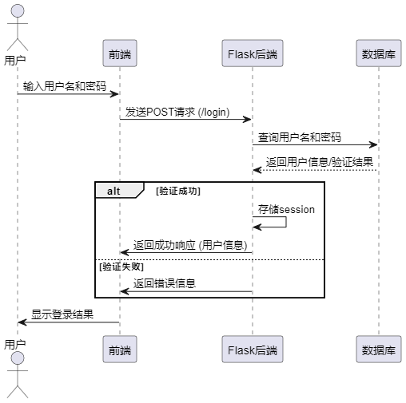

图4.3 登录时序图

#### 注册功能设计

注册时序图如图4.4所示，用户在前端输入用户名、密码和真实姓名后提交注册请求。后端接收请求后，首先检查用户名是否已存在。若用户名可用，则创建新用户并存入数据库，返回注册成功的响应。若用户名已存在，则返回用户名已存在的错误信息，前端向用户展示服务端返回的信息，提示用户操作是否成功。

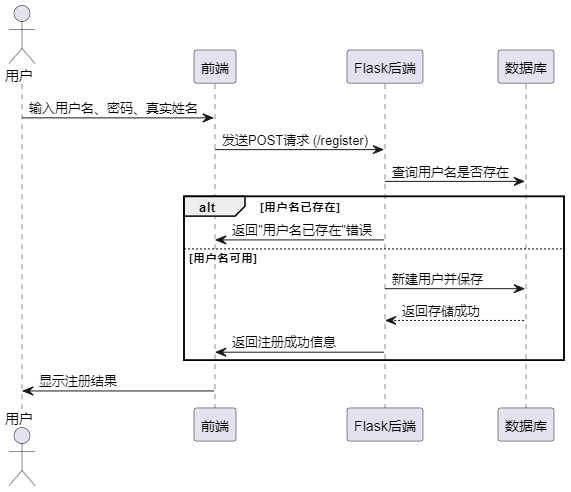

图4.4 注册时序图

#### 数据爬取功能设计

爬虫时序图如图4.5所示，爬虫基于 Scrapy 框架抓取智联招聘的职位信息，采用深度优先策略以优化数据获取效率。程序启动时，用户输入城市 ID（city_id）和学历 ID（edu_id），根据这些参数构造请求 URL，获取职位数据的 JSON 响应。首先解析 totalcount 以确定爬取策略：若总数不超过 90，直接解析当前页数据；若在 90 到 270 之间，则分页抓取 2-3 页；若超过 270，则按公司类型（companyType）进一步细分请求，若仍超出 270 条数据，则继续按公司规模（companySize）细分，逐步缩小数据范围，减少单次请求量。最终，解析并提取职位名称、公司名称、城市、薪资范围、公司规模、福利待遇等字段，并存入 数据库中。

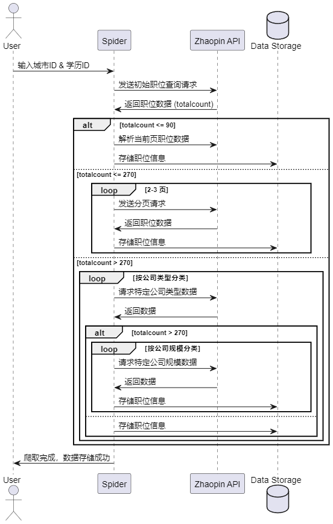

图4.5 爬虫时序图

#### 数据看板功能设计

本系统数据看板功能涵盖了职位统计，职位城市分析，词云分析，薪酬分析等，这里主要介绍词云分析与薪酬分析的设计过程。

词云分析时序图如图4.6所示，服务端首先从数据库 Job 表中查询最多 5000 条记录，并提取 welfare 字段内容进行拼接，使用 jieba 进行中文分词，统计各个词语的出现频率。系统对统计结果按照词频进行降序排序，并过滤掉单字符词语（如标点符号），将处理后的词频数据转换为 JSON 格式并返回，前端通过Echarts框架渲染服务端分析后返回的结果，向用户展示词云分析结果。

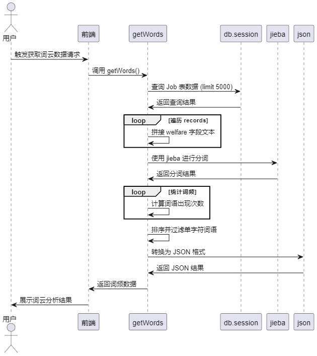

图4.6 词云分析时序图

薪酬分析时序图如图4.7所示，用户通过前端获取薪酬分析结果，后端通过预定义的城市列表（上海、北京、深圳、广州、苏州）查询对应城市中薪酬信息有效（salary1 不为 0）的职位记录。对于每个职位，接口提取格式化后的学位、当前薪资、原始薪资、职位名称以及公司名称等关键信息，并将这些数据按城市归类。最终，将所有城市的薪酬数据与城市标签一起打包，返回给前端，供后续薪酬分布分析和可视化展示使用。

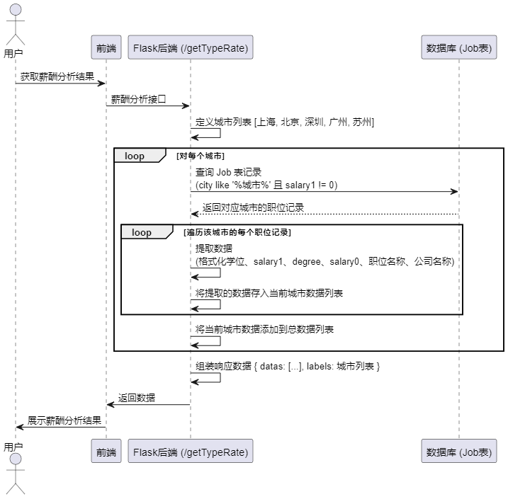

图4.7 薪酬分析时序图

#### 职位评分功能设计

职位评分功能时序图如图4.8所示，评分功能的逻辑设计主要包括评分的新增、更新与查询操作。当用户对某个职位进行评分时，系统首先接收用户ID、职位ID以及评分值，并进行参数校验。随后查询数据库判断是否已存在该用户对该职位的评分记录：若存在，则更新原有评分值；若不存在，则新增一条评分记录并写入数据库。评分查询功能则根据用户ID与职位ID从评分表中检索对应记录，若找到则返回评分值，否则默认返回0分。

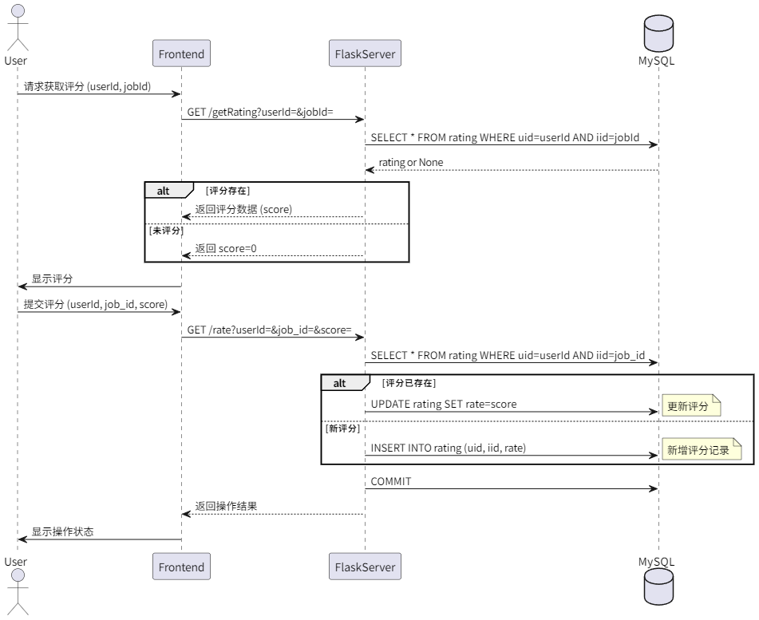

图4.8 职位评分功能时序图

#### 数据推荐功能设计

推荐功能的逻辑设计如图4.9所示，用户通过前端界面对职位进行打分，这些评分信息存储在评分表 tb_rate 中，表中记录了用户ID（uid）、职位ID（iid）和评分值（rate）。推荐算法采用基于项目的协同过滤（ItemCF）方式，首先从评分表中获取“用户-职位”的评分数据集，并计算职位之间的相似度；接着，根据目标用户的评分历史，找到与其评分职位相似的其他职位，并生成推荐列表。在推荐结果生成后，系统根据职位ID从职位表中查询职位详情，如职位名称、公司、薪资等信息，最终将完整的推荐内容返回给前端展示。

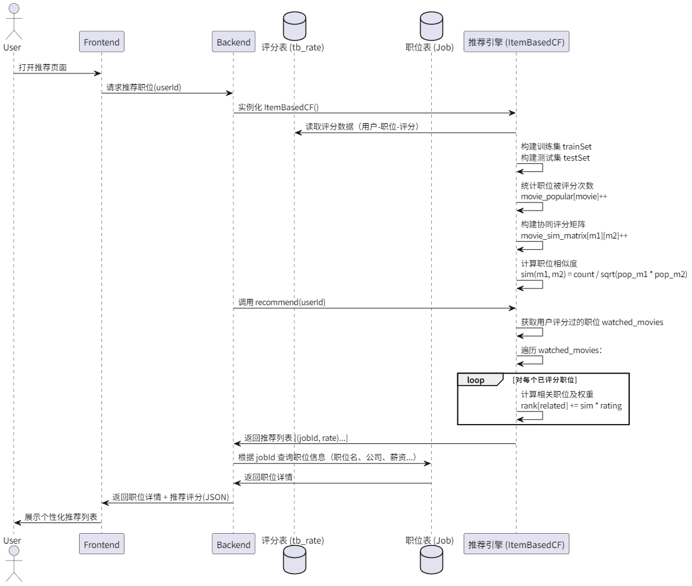

图4.9 数据推荐时序图

### 数据库设计

本系统数据库使用的是MySQL数据库，根据本系统需求分析的功能，本系统数据库共有设计了3张表：用户表，打分表，工作表。其中用户表存储本系统用户数据，支撑登录，注册功能需要的数据；打分表存储的是用户的打分数据，来实现工作数据推荐，工作表存储的是爬取到的工作数据。

用户表结构如表4.1所示，主要存储了用户基本信息，重要字段为username与password，来实现登录与注册功能。

表4.1 用户表

<table>
<tr><td>字段名</td><td>数据类型</td><td>主键/允许空</td><td>字段含义</td></tr>
<tr><td>id</td><td>int</td><td>PRIMARY KEY</td><td>用户表主键</td></tr>
<tr><td>username</td><td>varchar</td><td>不允许</td><td>登录账号</td></tr>
<tr><td>password</td><td>varchar</td><td>不允许</td><td>登录密码</td></tr>
</table>

工作表结构如表4.2所示，主要存储爬取到的工作数据，为后续的数据分析做支撑。

表4.2 职位信息表

<table>
<tr><td>字段名</td><td>数据类型</td><td>主键/允许空</td><td>字段含义</td></tr>
<tr><td>city</td><td>varchar(255)</td><td>NULL</td><td>城市</td></tr>
<tr><td>coattr</td><td>varchar(255)</td><td>NULL</td><td>企业类型</td></tr>
<tr><td>company_logo</td><td>varchar(512)</td><td>NULL</td><td>公司logo</td></tr>
<tr><td>company_name</td><td>varchar(255)</td><td>NULL</td><td>公司名称</td></tr>
<tr><td>company_url</td><td>varchar(255)</td><td>NULL</td><td>公司官方地址</td></tr>
<tr><td>cosize0</td><td>double</td><td>NULL</td><td>人数</td></tr>
<tr><td>cosize1</td><td>double</td><td>NULL</td><td>人数</td></tr>
<tr><td>degree</td><td>varchar(255)</td><td>NULL</td><td>招聘要求</td></tr>
<tr><td>education</td><td>varchar(255)</td><td>NULL</td><td>学历要求</td></tr>
<tr><td>id</td><td>int</td><td>PRIMARY KEY</td><td>主键</td></tr>
<tr><td>number</td><td>varchar(255)</td><td>PRIMARY KEY</td><td>流水号</td></tr>
<tr><td>position_name</td><td>varchar(255)</td><td>NULL</td><td>职位名称</td></tr>
<tr><td>province</td><td>varchar(50)</td><td>NULL</td><td>省份</td></tr>
<tr><td>publish_time</td><td>varchar(255)</td><td>NULL</td><td>上传时间</td></tr>
<tr><td>salary0</td><td>double</td><td>NULL</td><td>薪酬范围</td></tr>
<tr><td>salary1</td><td>double</td><td>NULL</td><td>薪酬范围</td></tr>
<tr><td>url</td><td>varchar(255)</td><td>NULL</td><td>招聘地址</td></tr>
<tr><td>welfare</td><td>varchar(255)</td><td>NULL</td><td>福利</td></tr>
<tr><td>worktime0</td><td>double</td><td>NULL</td><td>工作时间</td></tr>
<tr><td>worktime1</td><td>double</td><td>NULL</td><td>工作时间</td></tr>
</table>

职位评分表（如表4.3所示）主要用于存储用户对职位的评分信息，包含用户主键、职位主键以及对应的评分值，为后续实现个性化职位推荐提供数据支持。

表4.3 职位评分表

<table>
<tr><td>字段名</td><td>数据类型</td><td>主键/允许空</td><td>字段含义</td></tr>
<tr><td>id</td><td>int</td><td>PRIMARY KEY</td><td>主键</td></tr>
<tr><td>uid</td><td>int</td><td>不允许</td><td>用户主键</td></tr>
<tr><td>iid</td><td>int</td><td>不允许</td><td>工作表主键</td></tr>
<tr><td>rate</td><td>double</td><td>不允许</td><td>评分</td></tr>
</table>

## 系统实现

本章详细阐述了系统的实现过程，包括登录注册功能、数据大屏分析、薪酬分析、词云分析、职位查看、职位推荐等功能实现过程与结果。

### 数据爬取实现

数据爬取使用了Python的Requests依赖包，首先定义目标网站链接：https://fe-api.zhaopin.com/c/i/jobs/searched-jobs，通过浏览器观察，请求该链接返回的是JSON数组，如图5.1所示。

图5.1 浏览器返回

然后通过智联官网确定好城市id，一切准备工作完成后，在python脚本中定义主函数，通过pymysql的connect函数初始化MySQL链接，在insert_job函数中定义insert语句，然后定义crawl_city函数，此函数中，通过for关键字进行分页循环，然后拼接爬取链接，拼接上城市id参数，分页参数，通过requests.get函数进行数据爬取，获取到数据后，通过json函数将数据转为JSON字符串形式，获取结果list，然后循环该list，调用哦insert_job函数将爬取的数据插入数据库中，然后在主函数main方法中，循环之前准备好的城市id city_ids，在循环中调用crawl_city函数，以此来获取该城市的所有工作岗位数据，循环结束以此调用cursor.close()与db.close()关闭数据库链接，主要代码如下所示：

def crawl_city(city_id, max_page=10):
 for page_no in range(1, max_page + 1):
 url = f"https://fe-api.zhaopin.com/c/i/jobs/searched-jobs?pageNo={page_no}&pageSize=90&cityId={city_id}"
 print(f"正在抓取城市ID {city_id} 第 {page_no} 页...")
 try:
 response = requests.get(url, headers=headers, timeout=10)
 data = response.json()
 job_list = data.get('data').get('list')
 for job in job_list:
 insert_job(job)
 print(f"插入：{job.get('name')} @ {job.get('company')}")
 except Exception as e:
 print(f"抓取失败: {e}")
 time.sleep(1)
def main():
 for city_id in city_ids:
 crawl_city(city_id)
 print("所有城市职位抓取完成！")
 cursor.close()
 db.close()

### 登录注册实现

本系统的登录和注册功能由 Vue.js 前端与 Flask 后端协同实现，系统登录界面如图5.2所示。

图5.2 登录界面效果图

前端使用 Vuetify 组件构建登录和注册界面，并通过 v-window 实现步骤切换。用户输入 username、password 和 realname 后，点击登录按钮触发 login() 方法，该方法先校验用户名和密码是否填写完整，然后调用后端 /login 接口进行身份验证。验证成功后，用户信息将存入 Vuex，并跳转至首页。注册流程中，register() 方法会校验用户输入的完整性，并向后端 /register 接口发送请求。后端使用 Flask 提供 /register 和 /login API，/register 先检查用户名是否已存在，若不存在，则创建用户并写入数据库；/login 则校验用户名和密码是否匹配，匹配成功后将用户信息存入 Session 并返回相应数据，系统注册界面如图5.2所示，登录服务端关键代码如下所示：

res = ResMsg()
username = request.json['username']
password = request.json['password']
if valid_login(username, password):
 # flash(username + "登录成功")
 session['username'] = username
 # userId = db.session.query(User.id).filter(User.username==username).first()
 user = db.session.query(User).filter(User.username == username).first()
 json = user_schema.dump(user)
 # print(userId)
 res.update(code=ResponseCode.SUCCESS,msg=ResponseMessage.SUCCESS,data=json)
else:res.update(code=ResponseCode.ACCOUNT_OR_PASS_WORD_ERR,msg=ResponseMessage.ACCOUNT_OR_PASS_WORD_ERR)
return res.data

图5.3 注册界面效果图

### 数据大屏分析功能实现

数据大屏分析界面如图5.4所示，本系统的数据大屏分析模块基于 Vue.js 和 Vuetify 组件库进行构建，结合 Flask 提供的后端 API，实现了招聘数据的可视化展示。前端通过 v-container 和 v-layout 进行布局，采用 v-card 组件展示关键指标数据，如职位数、城市数、公司数和职位类型，使用 vue-count-to 实现数据动态增长效果，增强视觉表现力。同时，系统集成了 Echarts，构建职位城市分析、职位省份分析、岗位学历分析等多种图表组件，并通过 v-basic-card 进行封装，使页面结构清晰且便于扩展。此外，系统还嵌入了视频播放功能，通过 video 标签加载本地资源，为用户提供更直观的招聘市场信息。数据获取方面，系统在 mounted 钩子函数中调用 getPanel 和 getCityJob API，异步获取招聘数据，并存储到组件 data 中，实现数据的实时展示。

服务端基于 Flask 框架，使用 SQLAlchemy 进行数据库查询，实现多个数据统计 API。getPanel 通过查询 Job 表获取职位总数、城市数、公司数及职位类型数，并返回数据。getCityJob 按省份统计职位数量，getCityJob2 按城市统计职位数量，分别使用 group_by 和 order_by 进行分组排序。getTypeRank 统计不同公司类型的职位数，getDegreeRank 统计不同学历需求的职位数，均按职位数量降序排列，关键代码如下所示：

@jobBp.route('/getCityJob', methods=["GET"])
def getCityJob():
 res = ResMsg()
 result = db.session.query(Job.province.label('name'), func.count('*').label('value')).group_by(Job.province).order_by(
 func.count('*').desc()).all()
 datas = chart_data.dump(result)
 res.update(code=ResponseCode.SUCCESS, data=datas)
 return res.data

其中一个前端画图代码
const option = {
 dataZoom: {
 show: false,
 startValue: this.startValue,
 endValue: this.endValue,
 },
 grid: {
 right: '3%',
 bottom: '4%',
 left: '3%',
 containLabel: true,
 },
 title: {
 },
 tooltip: {
 trigger: 'axis',
 axisPointer: {
 type: 'shadow',
 },
 },
 xAxis: {
 type: 'category',
 data: this.l1,
 axisLabel: {
 interval:0,
 rotate:40
 },
 axisLine: {
 lineStyle: {
 color: '#78909C',
 },
 },
 },
 yAxis: {
 type: 'value',
 axisLine: {
 lineStyle: {
 color: '#78909C',
 },
 },
 },
 series: [
 {
 data: seriesData,
 type: 'bar',
 barWidth: '35%',
 barGap: '-100%',
 itemStyle: {
 normal: {
 barBorderRadius: 30,
 color: new echarts.graphic.LinearGradient(0, 0, 0, 1, [
 {
 offset: 0,
 color: '#E1BEE7',
 },
 {
 offset: 0.5,
 color: '#BA68C8',
 },
 {
 offset: 1,
 color: '#7B1FA2',
 },
 ]),
 },
 },
 }
 ],
};

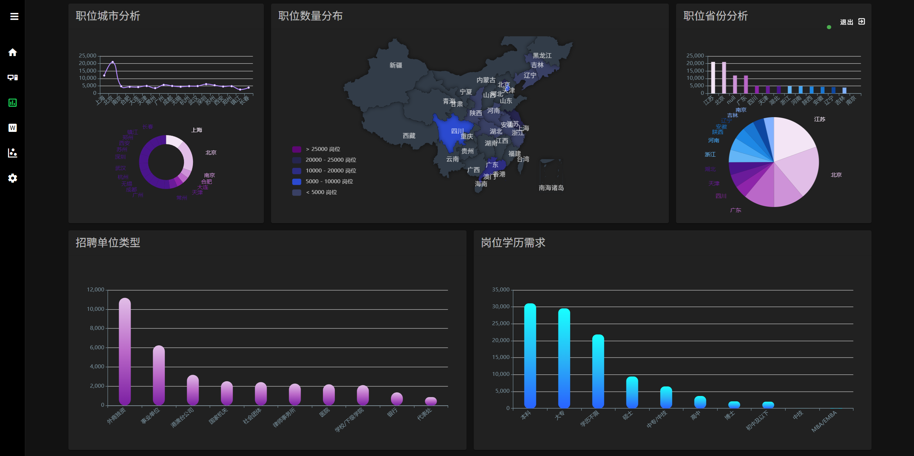

图5.4 数据大屏分析效果图

### 词云分析功能实现

词云分析实现界面如图5.5所示，前端使用了V-chart组件，设置Chart类型为词云类型，当用户进入此界面时，前端请求服务端接口getWordCut，服务端首先从数据库中查询 Job 表的记录，限制获取 5000 条数据。然后，遍历这些记录，将 welfare 字段的内容拼接成一个文本字符串。接着，使用 jieba 进行分词，并统计每个词的出现频率，存入字典 word_count 中。随后，将词频按照降序排序，并过滤掉长度小于 2 的无意义词汇，将统计结果转换为 JSON 格式，返回给前端，前端通过buildChartOption函数为词云图赋值，展示给用户，关键代码如下所示：

# 词频顺序进行排序，以元祖形式存储
word_count_sorted = sorted(word_count.items(), key=lambda x: x[1], reverse=True)
# print(word_count_sorted)
# 过滤结果中的标点符号和单词
word_count_sorted = filter(lambda x: len(x[0]) > 1, word_count_sorted)
# print(word_count_sorted)

# 元组转json
result = json.dumps(dict(word_count_sorted), ensure_ascii=False)
# result = json.dumps(dict(word_count_sorted), ensure_ascii=False)
print(json.loads(result))
result = json.loads(result)
return result

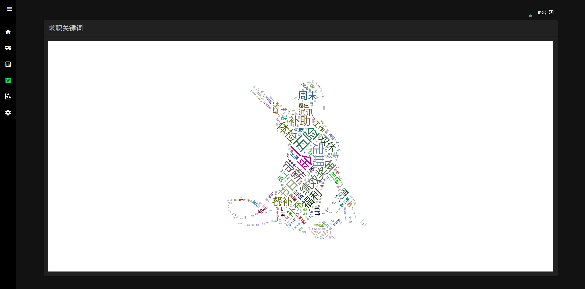

图5.5 词云分析效果图

### 薪酬分析功能实现

薪酬分析实现界面如图5.6所示，首先，通过 getTypeRate() API 获取数据，并提取 datas 中的五个数据集（d1 至 d5）以及分类标签 labels。随后，在 mounted 钩子中调用 buildChartOption() 方法，构建 ECharts 配置项。

在 buildChartOption() 方法中，定义了 scatter（散点图）类型的 series，并使用 symbolSize 计算气泡大小，以薪酬数值进行比例缩放。此外，tooltip 用于展示职位、公司、学历、薪酬等信息，xAxis 设定为 value 类型，并带有薪资单位格式化，yAxis 设定为 scale 以优化显示效果。

将chartOption 绑定到 v-chart 组件，实现薪酬数据的可视化，帮助分析不同类型职位的薪资分布情况。

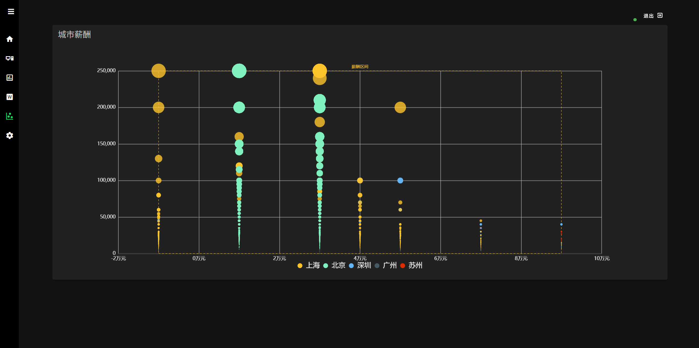

图5.6 薪酬分析效果图

### 职位查看功能实现

职位查看界面如图 5.7 所示，前端通过 `get()` 方法获取职位数据并存入 `items`，默认展示所有职位信息。用户可通过 `SearchBox` 组件输入关键词进行搜索，触发 `handleSearchResult()` 方法，更新 `items`，实现职位筛选。职位数据通过 `v-row` 和 `v-col` 进行网格布局，并由 `JobCard` 组件渲染职位详情，实现动态展示与管理。同时，界面集成了分页组件，用户可通过分页组件切换页面，触发 `handlePageChange()` 方法，更新当前页码并重新获取对应页的数据，关键代码如下所示：

keyword = request.args.get('keyword', '')
page = request.args.get('page', 1, type=int) # 获取当前页码，默认为1
per_page = request.args.get('per_page', 10, type=int) # 每页显示数量，默认为10

# 分页查询
pagination = db.session.query(Job).filter(Job.position_name.like('%' + keyword + '%')) \
 .order_by(Job.publish_time.desc()) \
 .paginate(page=page, per_page=per_page, error_out=False)

# 获取当前页的数据
items = pagination.items
data = job_schema.dump(items)

# 返回分页信息
res.update(code=ResponseCode.SUCCESS, data={
 'items': data,
 'total': pagination.total, # 总记录数
 'pages': pagination.pages, # 总页数
 'current_page': pagination.page, # 当前页码
 'per_page': pagination.per_page # 每页记录数
})
return res.data

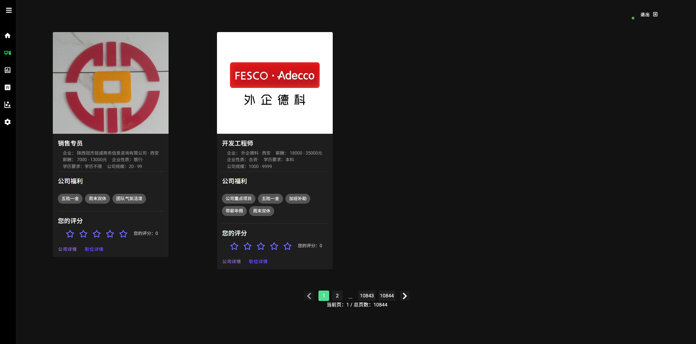

图5.7 职位查看效果图

服务端通过 Flask 处理 GET 请求，获取 `keyword`、`page` 和 `per_page` 参数，在数据库中查询匹配的职位名称，并按发布时间降序排序，返回对应页的数据。查询结果包含职位数据及分页信息（如总记录数、总页数、当前页码等），最终序列化为 JSON 响应返回给前端。

### 职位评分功能实现

职位评分实现效果如图5.8所示，用户可查看职位详情、公司信息、福利待遇，并对感兴趣的职位进行评分。评分结果通过调用后端接口 submitRatingAPI 进行保存，初始挂载时通过 getRating 获取用户历史评分。

服务端通过 Flask 提供两个接口，分别用于获取用户对某职位的评分（/getRating）和提交评分（/rate）。当用户评分时，系统判断该用户是否已有评分记录，有则更新，无则新增，并保存到数据库中，关键代码如下所示：

@jobBp.route('/rate', methods=["GET"])

def rate():

user_id = request.args.get('userId')

job_id = request.args.get('jobId')

score = request.args.get('rating')

rating = db.session.query(Rating).filter_by(uid=user_id, iid=job_id).first()

if rating:

rating.rate = score # 更新评分

else:

db.session.add(Rating(uid=user_id, iid=job_id, rate=score)) # 新增评分

db.session.commit()

图5.8 职位评分效果图

### 职位推荐功能实现

职位推荐界面如图5.9所示，该推荐系统基于 Item-Based Collaborative Filtering（基于物品的协同过滤） 实现，通过用户的历史评分数据计算工作岗位之间的相似度，并为用户推荐最相关的工作岗位。首先，从数据库中获取用户-工作岗位评分数据，并划分训练集和测试集。然后，统计每部工作岗位的流行度，构建共现矩阵，计算工作岗位之间的相似性。接着，针对目标用户，找到其观看过的工作岗位，根据这些工作岗位的相似工作岗位，结合用户评分计算推荐分数，最终返回最相关的工作岗位列表，关键代码如下所示：

def calc_movie_sim(self):
 for user, movies in self.trainSet.items():
 for movie in movies:
 if movie not in self.movie_popular:
 self.movie_popular[movie] = 0
 self.movie_popular[movie] += 1
 self.movie_count = len(self.movie_popular)
 print("Total movie number = %d" % self.movie_count)
 for user, movies in self.trainSet.items():
 for m1 in movies:
 for m2 in movies:
 if m1 == m2:
 continue
 self.movie_sim_matrix.setdefault(m1, {})
 self.movie_sim_matrix[m1].setdefault(m2, 0)
 self.movie_sim_matrix[m1][m2] += 1

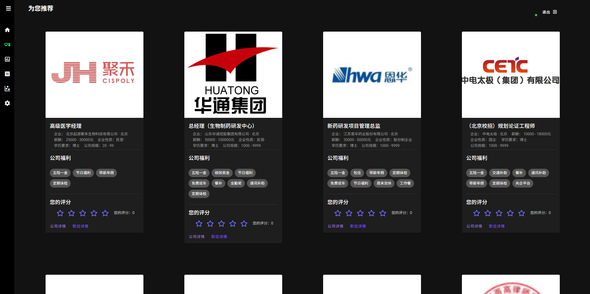

图5.9 职位推荐效果图

## 系统测试

本章阐述系统测试环境及主要功能测试用例，以确保系统功能的正常运行和稳定性。

### 测试环境与方法

本系统拟采用黑盒测试的方法，通过测试来检测每个功能是否都能正常使用。在测试中，把程序看作一个不能打开的黑盒子，在完全不考虑程序内部结构和内部特性的情况下，在程序接口进行测试，它只检查程序功能是否按照需求规格说明书的规定正常使用，程序是否能适当地接收输入数据而产生正确的输出信息。

系统在开发环境下进行测试：

操作系统：Windows11；

开发语言版本：Python3.7；MySQL8；Node.js 15.6；

编译器：Pycharm。

### 测试用例

登录测试用例如表6.1所示，主要测试账号与密码验证是否与设计一致，登录成功后是否可以生成Session。

表6.1 登录测试用例表

<table>
<tr><td>名称</td><td colspan="3">登录测试用例</td></tr>
<tr><td>概述</td><td colspan="3">测试账号与密码验证逻辑是否与设计一致 测试登录成功，接口是否返回了Session，UI是否跳转也页面 未登录的用户进入首页UI是否进行了限制，接口是否进行了限制 系统提前存入用户：admin，123456</td></tr>
<tr><td>步骤</td><td>步骤</td><td colspan="2">步骤</td></tr>
<tr><td></td><td>1</td><td colspan="2">未登录的用户，浏览器输入系统首页</td></tr>
<tr><td></td><td>2</td><td colspan="2">登录界面输入账号admin，密码12345</td></tr>
<tr><td></td><td>3</td><td colspan="2">登录界面输入账号admin，密码123456</td></tr>
<tr><td colspan="4">结果</td></tr>
<tr><td>结果</td><td>1a</td><td>用户未登录，UI跳转登录界面，接口被拦截</td><td>通过</td></tr>
<tr><td></td><td>2a</td><td>登录界面提示账号与密码错误</td><td>通过</td></tr>
<tr><td></td><td>3a</td><td>提示登录成功，UI跳转首页，接口返回了生成的Session</td><td>通过</td></tr>
</table>

系统注册测试，主要测试系统是否对账号进行了重复性判断，如表6.2所示。

表6.2 注册测试用例

<table>
<tr><td>名称</td><td colspan="3">注册测试用例</td></tr>
<tr><td>概述</td><td colspan="3">进行系统注册，测试系统是否对账号进行了唯一性判断</td></tr>
<tr><td>步骤</td><td>步骤</td><td colspan="2">步骤</td></tr>
<tr><td></td><td>1</td><td colspan="2">进入系统注册界面</td></tr>
<tr><td></td><td>2</td><td colspan="2">什么都不输入点击注册</td></tr>
<tr><td></td><td>3</td><td colspan="2">输入账号admin（重复），密码1234556</td></tr>
<tr><td></td><td>4</td><td colspan="2">输入账号admin（不重复），密码1234556</td></tr>
<tr><td colspan="4">结果</td></tr>
<tr><td>结果</td><td>1a</td><td>进入界面成功</td><td>通过</td></tr>
<tr><td></td><td>2a</td><td>注册失败，提示请输入基本信息</td><td>通过</td></tr>
<tr><td></td><td>3a</td><td>注册失败，账号重复</td><td>通过</td></tr>
<tr><td></td><td>4a</td><td>注册成功</td><td>通过</td></tr>
</table>

职位评分与推荐测试用例如表6.3所示，主要测试打分功能是否正常，推荐功能是否正常。

表6.3 职位评分测试用例

<table>
<tr><td>名称</td><td colspan="3">职位评分</td></tr>
<tr><td>概述</td><td colspan="3">测试用户是否可以进行评分，评分后数据是否回显，系统是否可以根据用户评分内容进行职位推荐</td></tr>
<tr><td>步骤</td><td>步骤</td><td colspan="2">步骤</td></tr>
<tr><td></td><td>1</td><td colspan="2">登录系统进入职位查看界面</td></tr>
<tr><td></td><td>2</td><td colspan="2">对职位进行搜索</td></tr>
<tr><td></td><td>3</td><td colspan="2">对职位进行评分，并进行评分更新</td></tr>
<tr><td></td><td>4</td><td colspan="2">进入职位推荐界面</td></tr>
<tr><td colspan="4">结果</td></tr>
<tr><td>结果</td><td>1a</td><td>进入职位查看界面</td><td>界面显示数据通过</td></tr>
<tr><td></td><td>2a</td><td>搜索职位</td><td>职位为关键字结果通过</td></tr>
<tr><td></td><td>3a</td><td>进行评分，并进行评分增加与更新</td><td>评分成功，评分更新成功，通过</td></tr>
<tr><td></td><td>4a</td><td>进入职位推荐界面成功，显示与该用户评分相似的职位</td><td>通过</td></tr>
</table>

数据分析测试用例如表6.4所示，主要测试有数据情况下是否可以正常进行分析，无数据情况下进行分析是否会拦截，分析的结果是否可以正常展示在界面上。

表6.4 数据分析测试

<table>
<tr><td>名称</td><td colspan="3">数据分析</td></tr>
<tr><td>概述</td><td colspan="3">测试数据分析功能是否正常</td></tr>
<tr><td>步骤</td><td>步骤</td><td colspan="2">步骤</td></tr>
<tr><td></td><td>1</td><td colspan="2">登录系统然后进入数据大屏界面</td></tr>
<tr><td></td><td>2</td><td colspan="2">登录系统然后进入词云分析界面</td></tr>
<tr><td></td><td>3</td><td colspan="2">登录系统然后进入薪酬分析界面</td></tr>
<tr><td></td><td>4</td><td colspan="2">未登录系统进入词云分析界面</td></tr>
<tr><td colspan="4">结果</td></tr>
<tr><td>结果</td><td>1a</td><td>成功进入数据大屏界面，系统展示大屏分析结果</td><td>通过</td></tr>
<tr><td></td><td>2a</td><td>成功进入词云分析界面，系统展示词云分析结果</td><td>通过</td></tr>
<tr><td></td><td>3a</td><td>成功进入薪酬分析页面，展示薪酬分析结果</td><td>通过</td></tr>
<tr><td></td><td>4a</td><td>系统检测到用户未登录，跳转到登录界面</td><td>通过</td></tr>
</table>

## 结论

本系统的设计与实现基于招聘数据的深入挖掘和可视化分析，旨在提高求职和招聘的效率，满足市场对就业信息的迫切需求。随着互联网技术的发展，招聘市场竞争愈发激烈，求职者和招聘者都需要更高效、直观的数据支持，以便做出更合理的决策。本系统通过 Python、Vue、Flask 和爬虫技术的结合，成功构建了一套完整的招聘数据可视化分析平台，为用户提供了高效的数据获取、分析和展示工具。

在数据获取方面，本系统通过编写网络爬虫，自动从智联招聘平台爬取不同城市的就业数据，确保数据的广泛性和实时性。经过清洗和转化，数据被存储至 MySQL 数据库，确保其结构化和高效管理。为了提升用户体验，系统采用 Flask 作为后端框架，提供稳定的 API 接口，保证前后端的数据交互顺畅。前端则基于 Vue 框架进行开发，并集成 Echarts 数据可视化库，实现招聘市场的多维度分析。用户可以通过柱状图、饼状图、词云等多种数据可视化方式，直观了解薪资水平、行业分布、岗位需求等关键信息，从而帮助求职者制定更合适的职业规划，助力企业优化招聘策略。

本系统的开发展示了数据采集、存储、处理和可视化的一体化流程，体现了数据分析在招聘行业中的应用价值。未来，该系统可以进一步扩展功能，如引入人工智能算法进行智能推荐，提高岗位匹配精准度，或增加多平台数据爬取，提高数据覆盖范围。此外，系统还可以结合更多外部数据源，提升分析的深度和广度，为招聘市场提供更精准、更具前瞻性的信息支持。

本系统不仅在技术实现上提供了完整的招聘数据可视化解决方案，也为求职者和招聘者提供了强有力的数据支持，推动招聘行业向智能化、数据化方向发展。未来，随着技术的不断进步和市场需求的进一步升级，该系统仍有广阔的优化和发展空间，为招聘市场的信息化进程带来更深远的影响。
